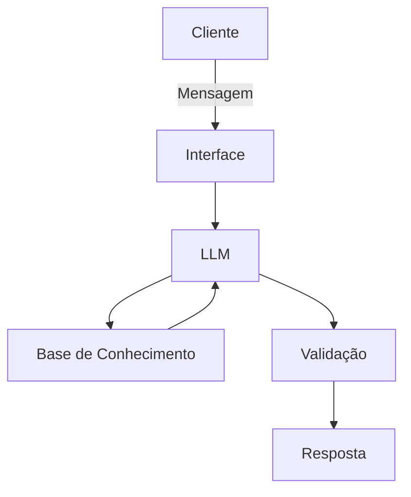

# 🤖 FinLearn

### Um agente de IA para ajudar você a entender melhor suas finanças.

O **FinLearn** é um agente de Inteligência Artificial desenvolvido para auxiliar na **educação financeira**, explicando conceitos de forma simples, acessível e contextualizada.

Seu objetivo é ajudar pessoas que:

* têm pouco tempo para estudar sobre finanças;
* encontram dificuldades com a linguagem utilizada por instituições financeiras;
* querem entender melhor seus gastos, investimentos e outros conceitos financeiros;
* preferem aprender por meio de exemplos e comparações práticas.

> **O FinLearn tem como objetivo educar, não recomendar investimentos.**

---

## 👩‍🏫 Conheça a Clara

Para tornar a interação mais natural, o FinLearn possui a **Clara**, sua assistente de IA.

Clara possui uma personalidade **educativa, paciente e acessível**. Ela procura adaptar suas explicações ao nível de conhecimento do usuário e para isso utiliza exemplos, comparações e analogias.

Seu papel é **explicar e contextualizar informações**, sem tomar decisões financeiras pelo usuário.

### Exemplos

Em vez de simplesmente apresentar uma definição:

> "Um CDB é um título de renda fixa emitido por uma instituição financeira."

Clara pode contextualizar:

> "Imagine que você empreste dinheiro para um banco. Em troca, o banco se compromete a devolver esse dinheiro posteriormente com uma remuneração. Essa é, de forma simplificada, a lógica de um CDB."

Dessa forma, conceitos que podem parecer complexos são apresentados de maneira mais próxima da realidade do usuário.

---

## 🏗️ Arquitetura

O FinLearn utiliza uma arquitetura baseada em um **LLM, uma base de conhecimento e uma camada de validação**, permitindo que a Clara utilize informações previamente definidas para elaborar suas respostas.

### Diagrama

### Componentes

| Componente               | Descrição                                                                                                                                                                         |
| ------------------------ | --------------------------------------------------------------------------------------------------------------------------------------------------------------------------------- |
| **Interface**            | Permite a interação com a Clara por meio de uma API ou chatbot desenvolvido com Streamlit.                                                                                        |
| **LLM**                  | Modelo de linguagem executado localmente utilizando Ollama.                                                                                                                       |
| **Base de Conhecimento** | Conjunto de informações estruturadas em JSON/CSV contendo conceitos financeiros, conhecimentos bancários e exemplos para contextualização.                                        |
| **Validação**            | Camada responsável por verificar se a resposta está de acordo com as regras definidas para o agente e reduzir respostas inadequadas ou sem fundamentação na base de conhecimento. |

---

## 🔐 Segurança e Privacidade

**⚠️ Esta seção representa os princípios de segurança e privacidade planejados para o projeto. Algumas funcionalidades ainda estão em desenvolvimento.**

O FinLearn foi projetado considerando a privacidade dos dados do usuário.

Entre os princípios planejados estão:

- A Clara não recomenda investimentos específicos.
- A Clara deve admitir quando não possui informações suficientes para responder.
- As respostas devem priorizar informações provenientes da base de conhecimento.
- Dados financeiros devem ser utilizados apenas quando necessários para a funcionalidade solicitada.
- A memória da Clara será opcional e controlada pelo usuário.
- O usuário poderá visualizar e excluir suas memórias.
- O uso de dados para treinamento será separado da funcionalidade de memória e dependerá de consentimento explícito.
- Informações sensíveis não devem ser utilizadas ou armazenadas sem necessidade.

---

## 🎯 Objetivo do projeto

O FinLearn está sendo desenvolvido como um projeto de estudo para explorar o desenvolvimento de **agentes de Inteligência Artificial**, utilizando um LLM como componente de raciocínio e adicionando ao seu redor mecanismos de conhecimento, validação e interação com o usuário.

A proposta não é desenvolver um novo modelo de linguagem do zero, mas compreender como modelos existentes podem ser utilizados na construção de uma aplicação de IA com **propósito, regras, contexto e ferramentas próprias**.
