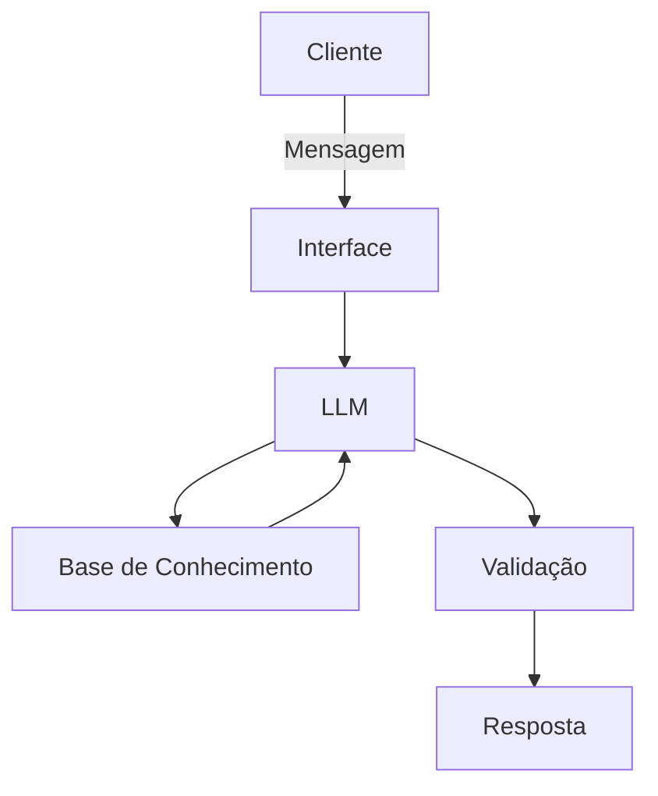

# 🤖 FinLearn
### Seu agente de IA educador financeiro, para te ajudar na sua educação financeira.
## Quem é FinLearn
Ele é um agente de IA focado em ensinar educação financeira para pessoas que não tem tempo para estudar ou que não entende a linguagem usada nas explicações de bancos.
E para tornar a experiencia dos usuários mais agradável ele conta com a assistente de IA Clara, que vai interagir com o usuário. 
## Quem é Clara
Ela é uma educada e paciente assistente de IA que usa exemplos e comparações para facilitar o entendimento do usuário.

## Arquitetura
### Diagrama

### Componentes
| Componente | Descrição |
|------------|-----------|
| Interface | Consultas via API e chatbot em Streamlit |
| LLM | Ollama (local) |
| Base de Conhecimento | JSON/CSV de conhecimentos bancários, exemplos de comparação |
| Validação | Checagem de alucinação |
